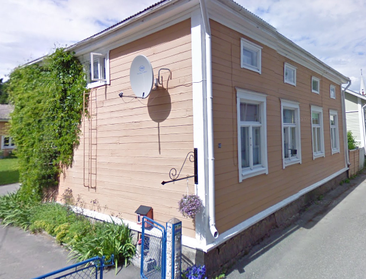

## Gårdens Historia

## Byggnadsiventering år <a href="/sources/keinanen_karki.pdf">1967</a>
1. Bostadshus med slätknut, primär slät liggande panel, valmat tak. A, MB
2. Uthus med knutskallar, lockläktspanel. A

## Situationen i dag
Byggnaderna som år 1967

## Ritningar
