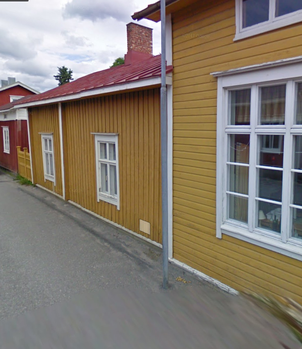

## Gårdens Historia
Gård 44 var ursprungligen stor till ytan och sträckte sig till Östra Långgatan. Nu hör 44 ihop med 45 och bildar tidigare skolgården. Se <a href="/buildings/287-1-122-1045/sv">fastighet 1045</a> för info om skolbyggnaderna.
