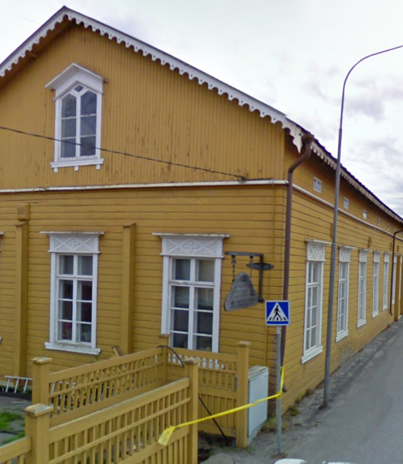

## Talon historia

## Rakennusinventointi <a href="/sources/keinanen_karki.pdf">v.1967</a>
1. Lyhytnurkkainen koulurakennus, rakennettu 1878, uurrettu vaakalaudoitus, satulakatto. B, MA. pvk. 10479
2. 2-kerroksinen koulurakennus, 1. kerros tiilestä, 2-kerr. hirsistä ja vaakalaudoitettu, satulakatto. C, MB
3. Tiilinen, rapattu koulurakennus rak.1 ja 2 välissä C, MB
4. Pitkänurkkainen koulurakennus, rak. 1833, vuoraus 1800-luvun lopulta, satulakatto. B, MA
5. Lyhytnurkkainen verstasrakennus, uurrettu vaakalaudoitus B
6. Pitkänurkkainen asuinrakennus, peiterimalaudoitus, satulakatto. B, MA.
7. Lautarakenteinen ulkorakennus C

## Nykytila

## Piirustukset
