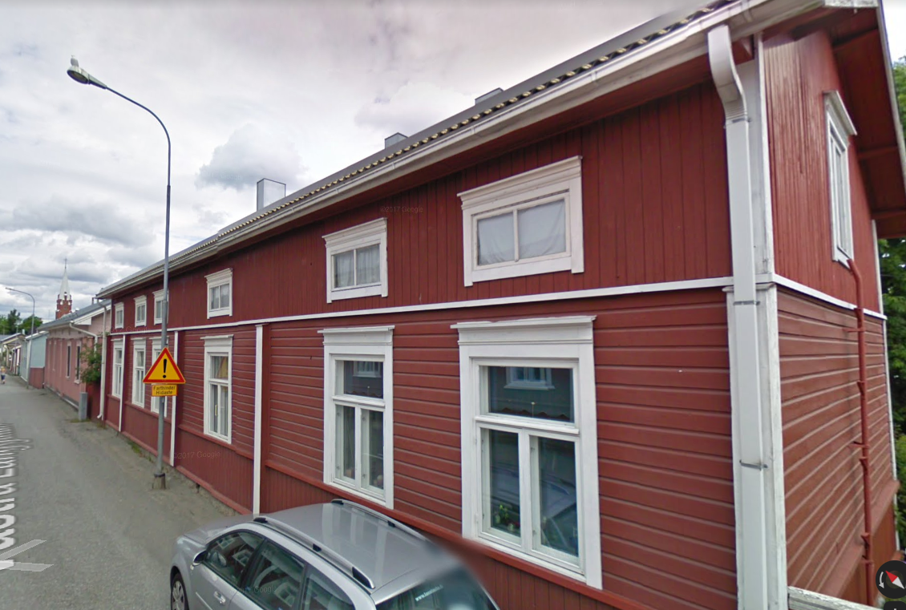

## Talon Historia

## Rakennusinventointi <a href="/sources/keinanen_karki.pdf">v.1967</a>
1. Pitkänurkkainen asuinrakennus 1800-luvulta, uusrenessanssivuoraus, satulakatto. B, MA.
2. Pitkänurkkainen asuinrakennus, peiterimavuoraus, satulakatto A, MA
3. Lautarakenteinen vaja. C

## Nykytila

## Piirustukset

## Ihmmisiä ja vaiheita
