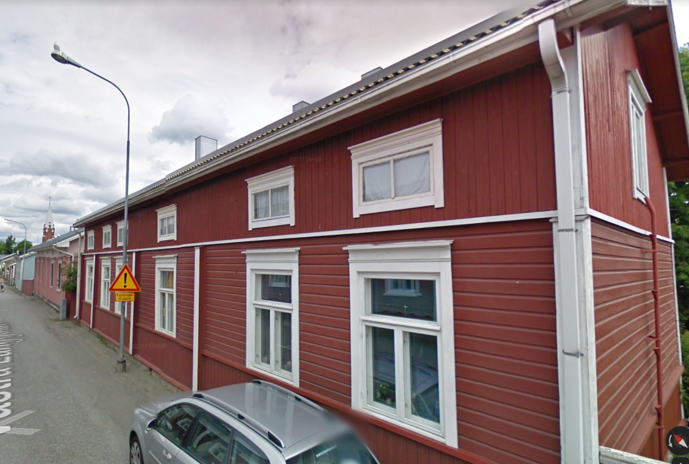

## Gårdens Historia

## Byggnadsiventering år <a href="/sources/keinanen_karki.pdf">1967</a>
1. Bostadshus med knutskallar från 1800-talet, nyrenässans fodring, sadeltak. B, MA.
2. Bostadshus med knutskallar, locklist, sadeltak. A, MA
3. Skjul av bräder. C

## Situationen i dag
Byggnaderna som år 1967

## Ritningar

## Mänskor o händelser