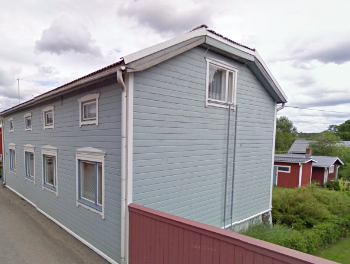

## Gårdens Historia

## Byggnadsiventering år <a href="/sources/keinanen_karki.pdf">1967</a>
1. Lyhytnurkkainen asuinrakennus 1800-luvulta, peiterimalaudoitus, satulakatto, pihan puolella tiilinen lämpökeskus. AI,MA
2. Ulkorakennus osaksi hirsistä, osaksi lautaa, peiterimalaudoitus. B.

## Situationen i dag

## Ritningar
