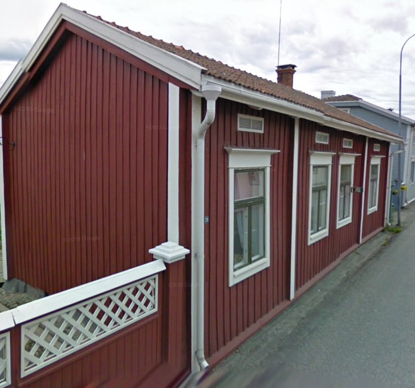

## Talon Historia
Kiinteistö 48 pilkottu kiinteistöihin 122-13 ja 122-12, Läntinen Pitkäkatu 26 A,B.

## Rakennusinventointi <a href="/sources/keinanen_karki.pdf">v.1967</a>
1. Pitkänurkkainen asuinrakennus, runko-osa rakennettu 1820, vinkkeli myöhäisempi, runko-osassa peiterimalaudoitus, vinkkeliosassa sekundaarinen kapea peiterimalaudoitus, satulakatto. A, MA
2. Pitkänurkkainen ulkorakennus, peiterimalaudoitus, satulakatto. B

## Nykytila

## Piirustukset
