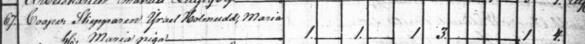
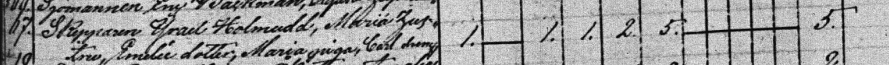
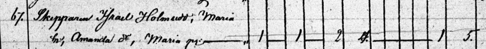
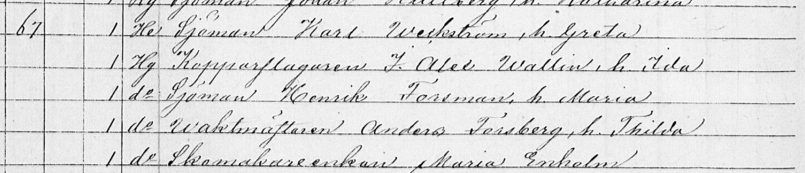

# "Intro"
Talon rakennutti laivuri kapteeni [Israel Holmudd](/people/holmudd_israel/fi) 1834 ja vaimonsa Maria Holmudd. Taloa laajennettiin 1844 ja pakarintupa rakennettiin. Talo sijaitsee eteläisen myllykallion reunalla, ja vuoden 1825 <a href="/maps/sundstedt1825/Grundrit_1.jpg">kaupunkikartassa</a> tontilla näkyy tuulimylly, mutta vuoden 1842 <a href="http://localhost:4000/maps/gylden1842/0cfae1878bb069b5a9f45b3d78a1417d8786f003.jpeg">kartasta</a> se puuttuu. Ilmeisesti se purettiin 1830 luvulla kun nykyiset rakennukset pystytettiin.
1870 luvulla talo siirtyi Weckströmien sukuun ja neljä sukupolvea Weckströmeitä tuli talossa asumaan, mm. [Åke Weckström](/people/weckström_åke/fi) joka tunnetaan Carlsron museon perustajana. Monet kutsuvat taloa Weckströmin taloksi.

# Rakennukset
## Piirustuksia ja muutoksia
<table>
  <tr>
    <td><table>
      <tr><td><b>1834</b></td></tr>
      <tr><td>Päärakennuksen ensimmäinen osa rakennetaan. Luultavasti eteläinen puolisko.</td></tr>
    </table></td>
    <td>
      Piirustus puuttuu.
    </td>
  </tr>
  <tr>
    <td><table>
      <tr><td><b>1844</b></td></tr>
      <tr><td>Päärakennus laajennetaan. Luultavasti eteläinen osa korotetaan ja talo laajennetaan pohjoiseen. Sisäkattoa ilmeisesti myös korotetaan eteläpäässä. Pakarintupa pystyteään.</td></tr>
    </table></td>
    <td>
      Piirustus puuttuu.
    </td>
  </tr>
  <tr>
    <td><table>
      <tr><td><b>1935</b></td></tr>
      <tr><td>Suuri muutos tehtiin 1935 kun talo muutettiin joka viiden asunnon taloksi. Aikaisemmin keittiöitä oli kaksi. Pohjoispäätyyn tuli kuisti, ja länsipuolella ollut taloon syvennetty veranta rakennetaan umpeen. Kaksi pientä kuistia rakentuu kahdelle uudelle sisäänkäynnille. </td></tr>
    </table></td>
    <td>
      
    </td>
  </tr>
  <tr>
    <td><table>
      <tr><td><b>1990</b></td></tr>
      <tr><td>Talo palautetaan yhden perheen asunnoksi yhdellä keittiöllä. Eteläinen sisäänkäynti rakennetaan umpeen ja suuri kuisti ilmestyy keskelle länsiseinää. Kuistin pylväät ovat peräisin höyrylaivalaturista (inventointikertomuksia). Kylpyhuone ja sauna rakennetaan pohjoisosaan länsipuolelle. </td></tr>
    </table></td>
    <td>
      Piirustuus puuttuu.
    </td>
  </tr>

</table>

## Rakennusinventointi <a href="/sources/keinanen_karki.pdf">v.1967</a>
1. Pitkänurkkainen asuinrakennus, peiterimalaudoitus, rakennettu 1834 ja lisärakennuettu 1844, aumakatto. AI,MA pvk. 4931 invent.kert. OM
2. Pitkänurkkainen asuinrakennus, entinen pakaritupa, peiterimalaudoitus, rakennettu 1843, satulakatto. A
3. Pitkänurkkainen ulkorakennus, osittain lautaa, pystylaudoitus, satulakatto. B
4. Vaja, pystylaudoitus. B

Talosta lötyy laajempi inventointikertomus vuoden 1967 inventoinneista <a href="inventointikertomuksia">Inventointikertomuksia</a>

### Nykytila
Sama kuin vuonna 1967

# Ihmisiä ja tapahtumia
Israelilla ja Marialla oli yksi tytär Emelie (ainoa kolmesta joka selvisi aikuiseksi) sekä piika Maria ja myöhemmin renki Carl. Maria jää leskeksi 1862. Vähän ennen sitä taloon otetaan ensimmäiset vuokralaiset. 1870 luvun puolessavälissä talo siirtyy Weckströmin suvun haltuun ja vuokralaisten määrä kasvaa rajusti suuressa talossa sekä pakarintuvassa, mm. kalastaja Ingström ja entinen palovahti Karl Their ensimmäisten joukossa. Neljä sukupolvea Weckströmeitä tulee asumaan talossa, mm. Åke Weckström joka ostaa sisarustensa osuudet talosta. Åke ostaa myöhemmin myös eteläisen panimon, <a href="/buildings/287-1-123-6/fi.html">tontin nro. 37</a> Hållfastinkadulla sekä <a href="http://www.museiportalosterbotten.fi/museum-a-o-en/museum/5-carlsro-museum">Carlson huvilan</a> josta hän tekee museon.

## Henkikirjoja

<table>
<tr>
    <td>
      <table>
        <tr><td><a href="http://digi.narc.fi/digi/view.ka?kuid=632741">Henkikirja 1835 gård 67</a></td></tr>
        <tr><td>Skepparen Israel Holmudd, Maria hustru</td></tr>
      </table>
    </td>
  <td></td>
</tr>
<tr>
    <td>
      <table>
        <tr><td><a href="http://digi.narc.fi/digi/view.ka?kuid=612905">Henkikirja 1840 gård 67</a></td></tr>
        <tr><td>Skepparen Israel Holmdd, Maria hustru,??</td></tr>
      </table>
    </td>
  <td></td>
</tr>
<tr>
    <td>
      <table>
        <tr><td><a href="http://digi.narc.fi/digi/view.ka?kuid=612905">Henkikirja 1845 gård 67</a></td></tr>
        <tr><td>Skepparen Israel Holmudd, Maria hustru, Maria piga</td></tr>
      </table>
    </td>
  <td></td>
</tr>
<tr>
    <td>
      <table>
        <tr><td><a href="http://digi.narc.fi/digi/view.ka?kuid=601660">Henkikirja 1850 gård 67</a></td></tr>
        <tr><td>Skepparen Israel Holmudd, Maria hustru, Emelie dotter, Maria piga, Carl dräng</td></tr>
      </table>
    </td>
  <td></td>
</tr>
<tr>
    <td>
      <table>
        <tr><td>1855 gård 67</td></tr>
        <tr><td></td></tr>
      </table>
    </td>
  <td></td>
</tr>
<tr>
    <td>
      <table>
        <tr><td><a href="http://digi.narc.fi/digi/view.ka?kuid=567463">Henkikirja 1860 gård 67</a></td></tr>
        <tr><td>Skepparen Israel Holmudd, Maria hustru, Lovisa piga, Skepparenkan J.E.??, Hilma hustru, Alexandra piga</td></tr>
      </table>
    </td>
  <td></td>
</tr>

<tr>
    <td>
      <table>
        <tr><td><a href="http://digi.narc.fi/digi/view.ka?kuid=626821">Henkikirja 1870 gård 67</a></td></tr>
        <tr><td>Skepparenkan Maria Holmudd, Fiskaren H.Ingström, hustru Augusta, förre brandvakten Karl Their</td></tr>
      </table>
    </td>
  <td></td>
</tr>

<tr>
    <td>
      <table>
        <tr><td><a href="http://digi.narc.fi/digi/view.ka?kuid=632501">Henkikirja 1875 gård 67</a></td></tr>
        <tr><td>Sjöman Karl Weckström, h. Greta, kopparslagaren Wallin, hustru Ida, sjöman Henrik Forsman, hustru Maria, Waktmästaren Anders Forsberg, hustru Thilda, skomakaränkan Maria Enholm</td></tr>
      </table>
    </td>
  <td></td>
</tr>

<tr>
    <td>
      <table>
        <tr><td><a href="http://digi.narc.fi/digi/view.ka?kuid=640343">Henkikirja 1880 gård 67</a></td></tr>
        <tr><td>Sjömansenkan Greta Weckström, Sjöman Emil Holmberg, hustru Amanda, Josef Lindman, hustru Anna, Henrik Forsman, hustru Maria, Styrmanshustrun Mathilda Holmberg, Arbetskarlsenkan Anna Lisa Österback</td></tr>
      </table>
    </td>
  <td></td>
</tr>

<tr>
    <td>
      <table>
        <tr><td><a href="http://digi.narc.fi/digi/view.ka?kuid=20434059">Henkikirja 1885 gård 67</a></td></tr>
        <tr><td>Sjömansenkan Greta Weckström, Sjömansotterna Augusta, Skomakarenkan Maria Wallin, Sjöman Herman Freds Wallin, Skomakaren Matts Nylund, Sjötullvaktmästaren Konstantin Malm, Sjöman Josef Sundblad, hustru Augusta, Dito Karl Forsström</td></tr>
      </table>
    </td>
  <td></td>
</tr>

</table>
