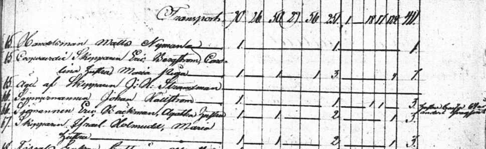

### Talon Historia
Talon rakennutti laivuri <a href="/people/holmudd_israel/sjoman.jpeg" rel="lightbox">Israel Holmudd</a> 1834 ja vaimonsa Maria Holmudd. Talo laajennettiin 1844 ja pakarintupa rakennettii. Vuoden 1825 <a href="/maps/sundstedt1825/Grundrit_1.jpg">kaupunkikartassa</a> tontilla näkyy tuulimylly, mutta vuoden 1842 <a href="http://localhost:4000/maps/gylden1842/0cfae1878bb069b5a9f45b3d78a1417d8786f003.jpeg">kartasta</a> se puuttuu. Ilmeisesti se purettiin 1830 luvulla kun nykyiset rakennukset pystytettiin.

### Rakennusinventointi <a href="/sources/keinanen_karki.pdf">v.1967</a>
1. Pitkänurkkainen asuinrakennus, peiterimalaudoitus, rakennettu 1834 ja lisärakennuettu 1844, aumakatto. AI,MA pvk. 4931 invent.kert. OM
2. Pitkänurkkainen asuinrakennus, entinen pakaritupa, peiterimalaudoitus, rakennettu 1843, satulakatto. A
3. Pitkänurkkainen ulkorakennus, osittain lautaa, pystylaudoitus, satulakatto. B
4. Vaja, pystylaudoitus. B

Talosta lötyy laajempi inventointikertomus vuoden 1967 inventoinneista <a href="inventointikertomuksia">Inventointikertomuksia</a>

### Nykytila
Sama kuin vuonna 1967

## Piirustuksia ja muutoksia
<table>
  <tr>
    <td><table>
      <tr><td><b>1834</b></td></tr>
      <tr><td>Päärakennuksen ensimmäinen osa rakennetaan. Luultavasti eteläinen puolisko.</td></tr>
    </table></td>
    <td>
      Piirustus puuttuu.
    </td>
  </tr>
  <tr>
    <td><table>
      <tr><td><b>1844</b></td></tr>
      <tr><td>Päärakennus laajennetaan. Luultavasti eteläinen osa korotetaan ja talo laajennetaan pohjoiseen. Sisäkattoa ilmeisesti myös korotetaan eteläpäässä. Pakarintupa pystyteään.</td></tr>
    </table></td>
    <td>
      Piirustus puuttuu.
    </td>
  </tr>
  <tr>
    <td><table>
      <tr><td><b>1935</b></td></tr>
      <tr><td>Suuri muutos tehtiin 1935 kun talo muutettiin joka viiden asunnon taloksi. Aikaisemmin keittiöitä oli kaksi. Pohjoispäätyyn tuli kuisti, ja länsipuolella ollut taloon syvennetty veranta rakennetaan umpeen. Kaksi pientä kuistia rakentuu kahdelle uudelle sisäänkäynnille. </td></tr>
    </table></td>
    <td>
      
    </td>
  </tr>
  <tr>
    <td><table>
      <tr><td><b>1990</b></td></tr>
      <tr><td>Talo palautetaan yhden perheen asunnoksi yhdellä keittiöllä. Eteläinen sisäänkäynti rakennetaan umpeen ja suuri kuisti ilmestyy keskelle länsiseinää. Kuistin pylväät ovat peräisin höyrylaivalaturista (inventointikertomuksia). Kylpyhuone ja sauna rakennetaan pohjoisosaan länsipuolelle. </td></tr>
    </table></td>
    <td>
      Piirustuus puuttuu.
    </td>
  </tr>

</table>

## Ihmisiä ja tapahtumia
Israelilla ja Marialla oli yksi tytär Emelie sekä renki Carl ja piika Maria. Mariasta jää leskeksi 1862 ja 1870 luvulla suureen taloon aletaan ottaa vuokralaisia, mm. kalastaja Ingström ja entinen palovahti Karl Their. Talo siirtyy Weckströmin suvun omistukseen. Neljä sukupolvea Weckströmeitä tulee asumaan talosaa, mm. Åke Weckström joka ostaa sisarustensa osuudet talosta. Åke ostaa myöhemmin myös eteläisen panimon, <a href="/buildings/287-1-123-6/fi.html">tontin nro. 37</a> Hållfastinkadulla sekä Carlsron huvilan josta hän tekee museon.

Henkikirja 1835 talo 67.
