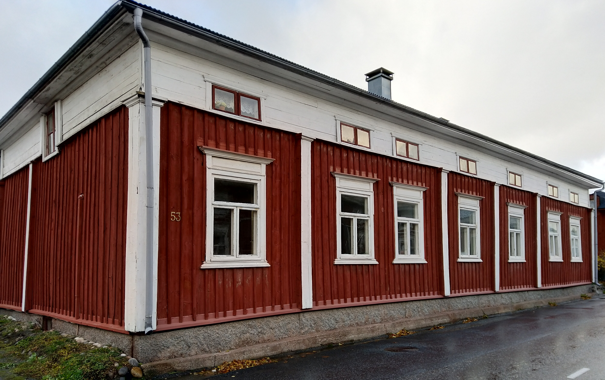

## Talon Historia
Talon rakennutti laivuri <a href="/people/holmudd_israel/sjoman.jpeg" rel="lightbox">Israel Holmudd</a> 1834 ja Maria Holmudd. Heillä oli tytär Emelie ja renki Carl sekä piika Maria. Maria jäi leskeksi 1862 ja 1870 luvulla suureen taloon aletiin ottaa vuokralaisia, mm. Kalastaja Ingström ja entinen palovahti Karl Their, ja talo siirtyi Weckströmin suvun omistukseen.

## Muutospiirrustukset
<table>
<tr>
<td><h2>1935</h2></td><td>
</td>
</tr>
</table>

## Rakennukset
1. Pitkänurkkainen asuinrakennus, peiterimalaudoitus, rakennettu 1834 ja lisärakennuettu 1844, aumakatto.
AI,MA
pvk. 4931
invent.kert. OM

2. Pitkänurkkainen asuinrakennus, entinen pakaritupa, peiterimalaudoitus, rakennettu 1843, satulakatto.
A

3. Pitkänurkkainen ulkorakennus, osittain lautaa, pystylaudoitus, satulakatto.
B

4. Vaja, pystylaudoitus.
B

## Quriosa
