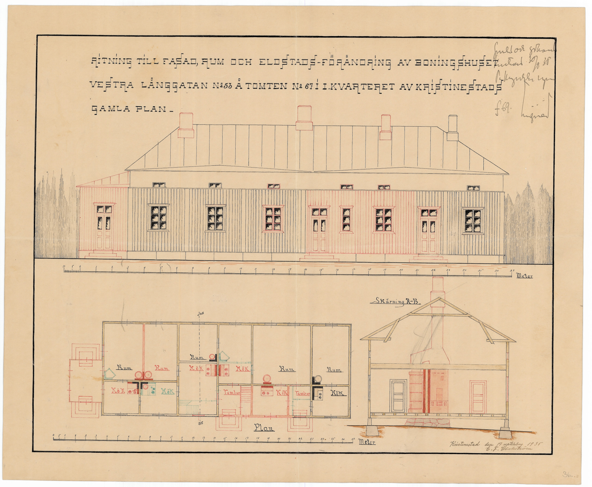

## Gårdens historia
Huset byggdes av skeppare <a href="/people/holmudd_israel/sjoman.jpeg" rel="lightbox">Israel Holmudd</a> 1834 med fru Maria. Huset utvidgades 1844 och bagarstugan byggdes till. På <a href="/maps/sundstedt1825/Grundrit_1.jpg">stadskarta från 1825</a> finns det inritat en väderkvarn på gården, medan den saknas på <a href="http://localhost:4000/maps/gylden1842/0cfae1878bb069b5a9f45b3d78a1417d8786f003.jpeg">1842 års karta</a>. Antagligen revs den då de nuvarande byggnaderna byggdes. Det är inte kännt vad det fanns för andra byggnader på Gård 67 före år 1834, men vilka som bodde här står att läsa i mantalslängderna.

## Byggnadsinventering <a href="/sources/keinanen_karki.pdf">v.1967</a>
1. Bostadshus med knutskallar, lockläkt, byggt 1834 utvidgat 1844, valmat tak. AI,MA brandförsäkring 4931 OM
2. Bostadshus med knutskallar, före detta bagarstuga, lockläkt, byggt 1843, sadeltak. A
3. Uthus med knutskallar, delvis reglad, stående panel, sadeltak. B
4. Skjul, reglat. B

En längre inventeringsberättlse från 1967 års inventering finns <a href="inventointikertomuksia">här</a> (på finska).

## Läget idag
Byggnaderna som år 1967

## Ritningar och ändringar
<table>
  <tr>
    <td><table>
      <tr><td><b>1834</b></td></tr>
      <tr><td>Första delen av huvudbyggnaden byggs. Antagligen södra halvan.</td></tr>
    </table></td>
    <td>
      Ritning saknas.
    </td>
  </tr>
  <tr>
    <td><table>
      <tr><td><b>1844</b></td></tr>
      <tr><td>Huvudbyggnaden byggs ut. Antagligen förhöjs den södra delen och huset förlängs norrut. Innertaket i södra delen förhöjs antagligen också. Bagarstugan kommer till.</td></tr>
    </table></td>
    <td>
      Ritning saknas.
    </td>
  </tr>
  <tr>
    <td><table>
      <tr><td><b>1935</b></td></tr>
      <tr><td>En stor förändring skedde 1935 då huset byggdes om till hela fem lägenheter från att ha haft två kök innan. Farstukvist byggs till i norra gaveln. Den öppna verandan på västra sidan som var en fördjupning in i huset, byggs in. I stället kommer två små farstukvistar till det två nya ingångarna.</td></tr>
    </table></td>
    <td>
      
    </td>
  </tr>
  <tr>
    <td><table>
      <tr><td><b>1990</b></td></tr>
      <tr><td>Byggnaden blir åter ett hem för en familj med ett kök. Den södra ingången byggs fast. En stor veranda byggs framför ingången i mitten som blir kvar. Pelarna i verandan lär härstamma från ångbåtsbryggan (inventointikertomuksia). Badrum och bastu kommer till i norr. </td></tr>
    </table></td>
    <td>
      Ritning saknas.
    </td>
  </tr>

</table>

## Människor och händelser
Israel och Maria hade en dotter Emelia (enda dotterna av tre som överlever tre års ålder) och pigan Maria samt senare drängen Carl. Maria blev änka 1862, kort innan tog man in de första hyresgästerna på gården. I medlet av 1870 övergår gården till Weckströmska släkten och antalet hyresgäster stiger kraftigt i det stora huset och bagarstugan, bl.a. Fiskaren Ingström och förre brandvakten Karl Their som första. Fyra generationer Weckström kom att bo i huset, bl.a. Åke Weckström som köpte ut sina syskon ur gården. Åke blev även ägare till Södra Bryggeriet, <a href="/buildings/287-1-123-6/sv.html">gård 37</a> vid Hållfastskagatan och villan <a href="http://www.museiportalosterbotten.fi/museum-a-o-en/museum/5-carlsro-museum">Carlso</a> som han gjorde till museum.

### Mantalslängder

<table>
<tr>
    <td>
      <table>
        <tr><td><a href="http://digi.narc.fi/digi/view.ka?kuid=632741">Mantalslängd 1835 gård 67</a></td></tr>
        <tr><td>Skepparen Israel Holmudd, Maria hustru</td></tr>
      </table>
    </td>
  <td></td>
</tr>
<tr>
    <td>
      <table>
        <tr><td><a href="http://digi.narc.fi/digi/view.ka?kuid=612905">Mantalslängd 1840 gård 67</a></td></tr>
        <tr><td>Skepparen Israel Holmdd, Maria hustru,??</td></tr>
      </table>
    </td>
  <td></td>
</tr>
<tr>
    <td>
      <table>
        <tr><td><a href="http://digi.narc.fi/digi/view.ka?kuid=612905">Mantalslängd 1845 gård 67</a></td></tr>
        <tr><td>Skepparen Israel Holmudd, Maria hustru, Maria piga</td></tr>
      </table>
    </td>
  <td></td>
</tr>
<tr>
    <td>
      <table>
        <tr><td><a href="http://digi.narc.fi/digi/view.ka?kuid=601660">Mantalslängd 1850 gård 67</a></td></tr>
        <tr><td>Skepparen Israel Holmudd, Maria hustru, Emelie dotter, Maria piga, Carl dräng</td></tr>
      </table>
    </td>
  <td></td>
</tr>
<tr>
    <td>
      <table>
        <tr><td>1855 gård 67</td></tr>
        <tr><td></td></tr>
      </table>
    </td>
  <td></td>
</tr>
<tr>
    <td>
      <table>
        <tr><td><a href="http://digi.narc.fi/digi/view.ka?kuid=567463">Mantalslängd 1860 gård 67</a></td></tr>
        <tr><td>Skepparen Israel Holmudd, Maria hustru, Lovisa piga, Skepparenkan J.E.??, Hilma hustru, Alexandra piga</td></tr>
      </table>
    </td>
  <td></td>
</tr>

<tr>
    <td>
      <table>
        <tr><td><a href="http://digi.narc.fi/digi/view.ka?kuid=626821">Mantalslängd 1870 gård 67</a></td></tr>
        <tr><td>Skepparenkan Maria Holmudd, Fiskaren H.Ingström, hustru Augusta, förre brandvakten Karl Their</td></tr>
      </table>
    </td>
  <td></td>
</tr>

<tr>
    <td>
      <table>
        <tr><td><a href="http://digi.narc.fi/digi/view.ka?kuid=632501">Mantalslängd 1875 gård 67</a></td></tr>
        <tr><td>Sjöman Karl Weckström, h. Greta, kopparslagaren Wallin, hustru Ida, sjöman Henrik Forsman, hustru Maria, Waktmästaren Anders Forsberg, hustru Thilda, skomakaränkan Maria Enholm</td></tr>
      </table>
    </td>
  <td></td>
</tr>

<tr>
    <td>
      <table>
        <tr><td><a href="http://digi.narc.fi/digi/view.ka?kuid=640343">Mantalslängd 1880 gård 67</a></td></tr>
        <tr><td>Sjömansenkan Greta Weckström, Sjöman Emil Holmberg, hustru Amanda, Josef Lindman, hustru Anna, Henrik Forsman, hustru Maria, Styrmanshustrun Mathilda Holmberg, Arbetskarlsenkan Anna Lisa Österback</td></tr>
      </table>
    </td>
  <td></td>
</tr>

<tr>
    <td>
      <table>
        <tr><td><a href="http://digi.narc.fi/digi/view.ka?kuid=20434059">Mantalslängd 1885 gård 67</a></td></tr>
        <tr><td>Sjömansenkan Greta Weckström, Sjömansotterna Augusta, Skomakarenkan Maria Wallin, Sjöman Herman Freds Wallin, Skomakaren Matts Nylund, Sjötullvaktmästaren Konstantin Malm, Sjöman Josef Sundblad, hustru Augusta, Dito Karl Forsström</td></tr>
      </table>
    </td>
  <td></td>
</tr>

</table>
