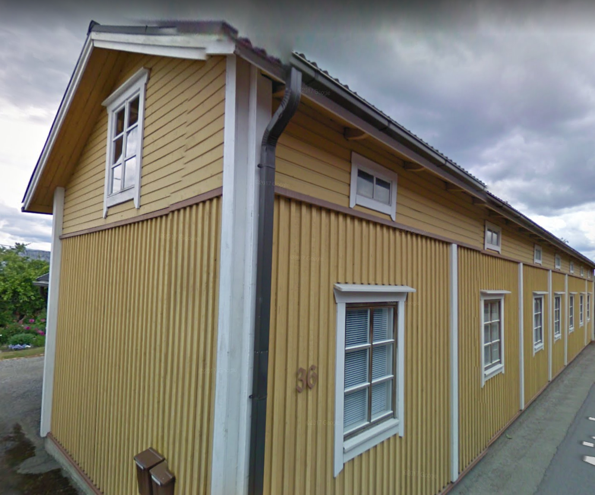

## Talon Historia

## Rakennusinventointi <a href="/sources/keinanen_karki.pdf">v.1967</a>
1. Lyhytnurkkainen asuinrakennus 1800-luvulta, uudelleenvuorattu n. 1950, ikkunat uusittu, satulakatto.C, MAI
2. Ulkorakennus, osittain hirsistä, osittain laudoista, osittain lomalaudoitettu, osittain vaakalaudoitettu. B
3. Sauna, peiterimalaudoitus,

## Nykytila

## Piirustukset
