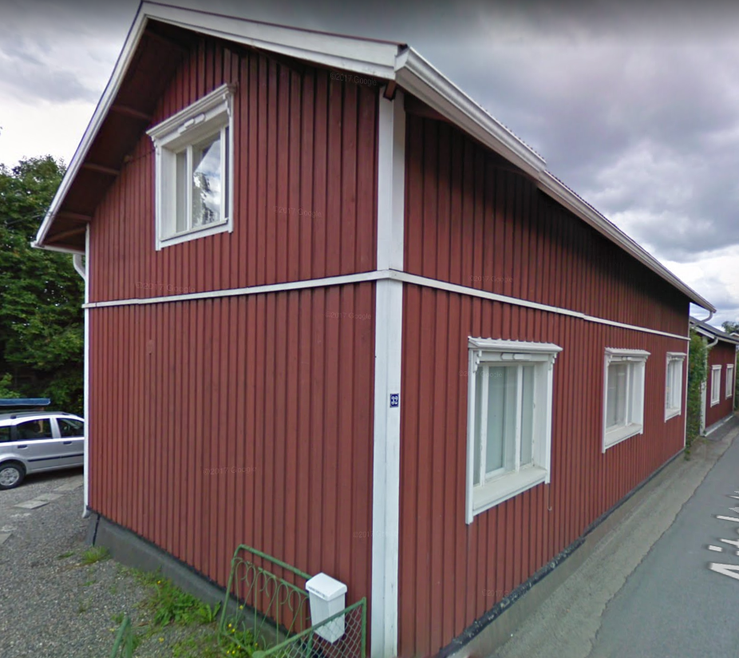

## Talon Historia

## Rakennusinventointi <a href="/sources/keinanen_karki.pdf">v.1967</a>
1. Pitkänurkkainen asuinrakennus 1800-luvulta, ikkunat uusittu 1967. B, MAI
2. Asuin- ja ulkorakennus , peiterimalaudoitus. C, MAI

## Nykytila

## Piirustukset
