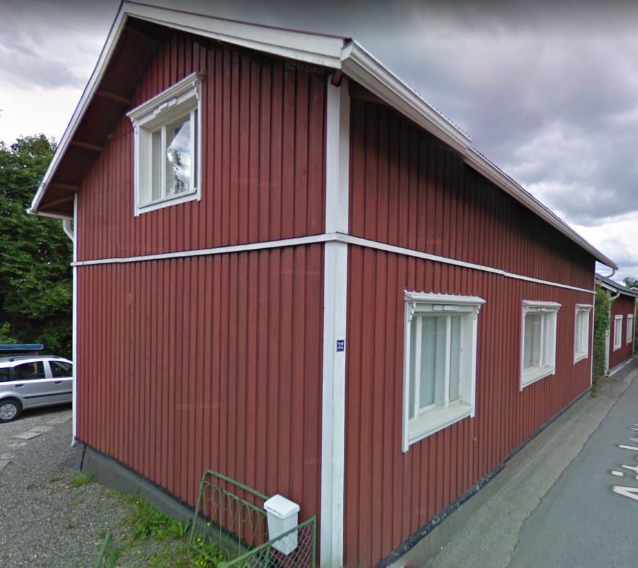

## Gårdens Historia

## Byggnadsiventering år <a href="/sources/keinanen_karki.pdf">1967</a>
1. Pitkänurkkainen asuinrakennus 1800-luvulta, ikkunat uusittu 1967. B, MAI
2. Asuin- ja ulkorakennus , peiterimalaudoitus. C, MAI

## Situationen i dag

## Ritningar

## Mänskor och händelser