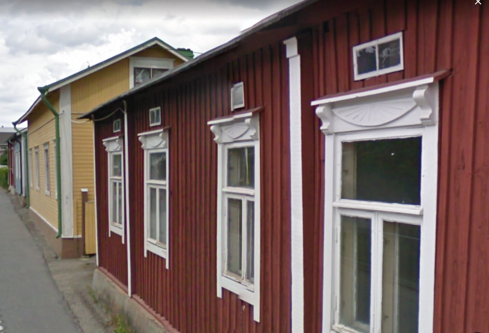

## Talon Historia

## Rakennusinventointi <a href="/sources/keinanen_karki.pdf">v.1967</a>
1. Pitkänurkkainen asuinrakennus, rakennettu 1842 ja 1858, primaarinen peiterimalaudoitus, satulakatto. AI , MAI pvk. 4160
2. Lyhytnurkkainen asuinrakennus, sekundaarinen vaakalaudoitus, satulakatto. B, MAI
3. Lyhytnurkkainen ulkorakennus, lomalaudoitus , satulakatt A
4. Ulkorakennus vuodelta 1960, peiterimalaudoitus, satulakatto C

## Nykytila
Sama kuin vuonna 1967

## Piirustukset

## Ihmiset ja vaiheet
