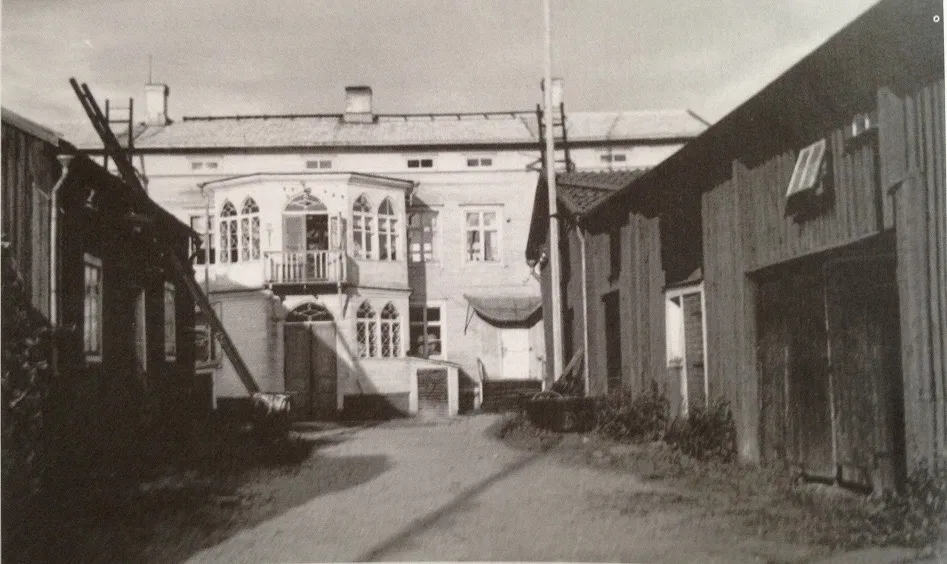
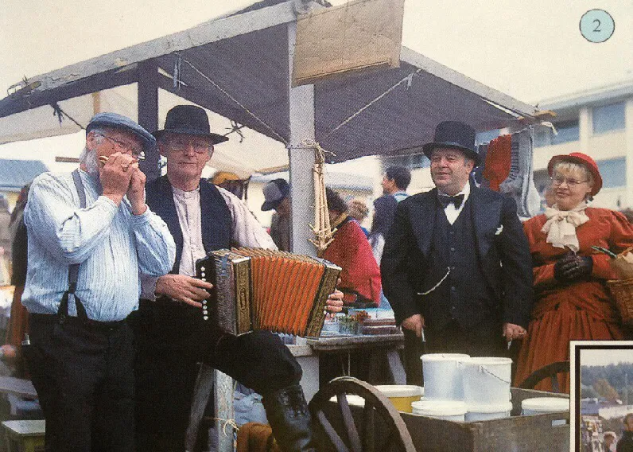

# "Intro"
Päärakennuksen rakennutti vuonna 1812 kauppias Anders Z. Holmström ja sen tyylissä näkyy vaikutteita eurooppalaisesta uusgotiikasta. [Carl Wilhelm Kräpelin](/people/kräpelin_carl_wilhelm/fi) oli syntynyt Tukholmassa vuonna 1823 ja tuli Kristlinankaupunkiin Kokkolasta vuonna 1846. Kräpelin aloitti ensin [Simon Anders Wendelinin](/people/wendelin_simon_anders/fi) kirjannitäjänä ja siirtyi jonkin ajan kuluttua pitämään omaa kauppaliikettä Holmströmin taloon. Holmströmin kuoltua vuonna 1849 talo siirtyi Kräpelinin haltuun. Pihapiiri tunnetaan Krepelinin nimellä, vaikka sillä on kandensadan vuoden aikana ollut monta omistajaa.

# Rakennukset
Päärakennus on palovakuutuskirjan mukaan rakennettu 1812 ja vuorattu 1813 sekä maalattu punavärillä.
Talo on kaksikerroksinen, hirsistä rakennettu asuinrakennus. Rakennusta
kattaa satulakatto, joka on tehty 1900-luvun alkupuolella, kun alkuperäinen mansardikatto poistettiin.
Rakennuksen vuoraus on uusittu 1900-luvun alussa.

Päärakennuksesta oikealla ensimmäisenä sijaitseva ”Pakari” eli leivintupa rakennettiin 1815, kaksikerroksiset makasiinit vasemmalla vuosina 1806 ja 1816 ja oikealla olevat varastot ja liiteri 1811 ja 1870.

## Rakennusinventointi <a href="/sources/keinanen_karki.pdf">v.1967</a>
1. 2-kerr. lyhytnurkkainen asuinrakennus vuodelta 1812, sekundaarinen vuoraus, eteläpäässä primaarinen uurrettu vaakalaudoitus, satulakatto , pihafasadissa 5-kulmainen uusgoottilainen kuisti n.1860. B, MB. Palovakuutuskirja  76, inventointikertomuksia KM38
2. Pitkänurkkainen hirsirakennus, pakaritupa, rak.1814, peiterimalaudoitus, satulakatto, mustat lasitetut kattotiilet. A
3. Pitkänurkkainen aitta, rak. 1815, peiterimalaudoitus, satulakatto, mustat lasitetut kattotiilet. AI
4. Ulkorakennusrivi 1806 ja 1816, pitkänurkat, peiterimalaudoitus, satulakatto. AI
5. Pitkänurkkainen ulkorakennus, peiterimalaudoitus, satulakatto. B

Talosta lötyy laajempi inventointikertomus vuoden 1967 inventoinneista <a href="inventointikertomuksia">Inventointikertomuksia</a>

## Nykytila
Rakennukset kuten 1967

## Palovakuutuskirjat
Palovakuutuskirjat n:o 76 (v.1834 ja 1846) Tarmon arkisto

## Piirustuksia ja muutoksia

# Ihmisiä ja tapahtumia
vuonna 1834 tontin omisti kauppias  A.Z. Holmström. Kauppias C.W. Kräpelin
omisti tontin pvk:n mukaan 1856 ja hänen mukaansa päärakennusta sanotaankin
usein Kräpelinen taloksi. Vuonna 1901 tontti oli merimies Anders Lagerin hallussa ja v.1916 se
kuului panimomestari S. K Skadelle ja tämän jälkeen Kansalliskauppa Oy Sammolle.

## Henkikirjoja

# Galleria

