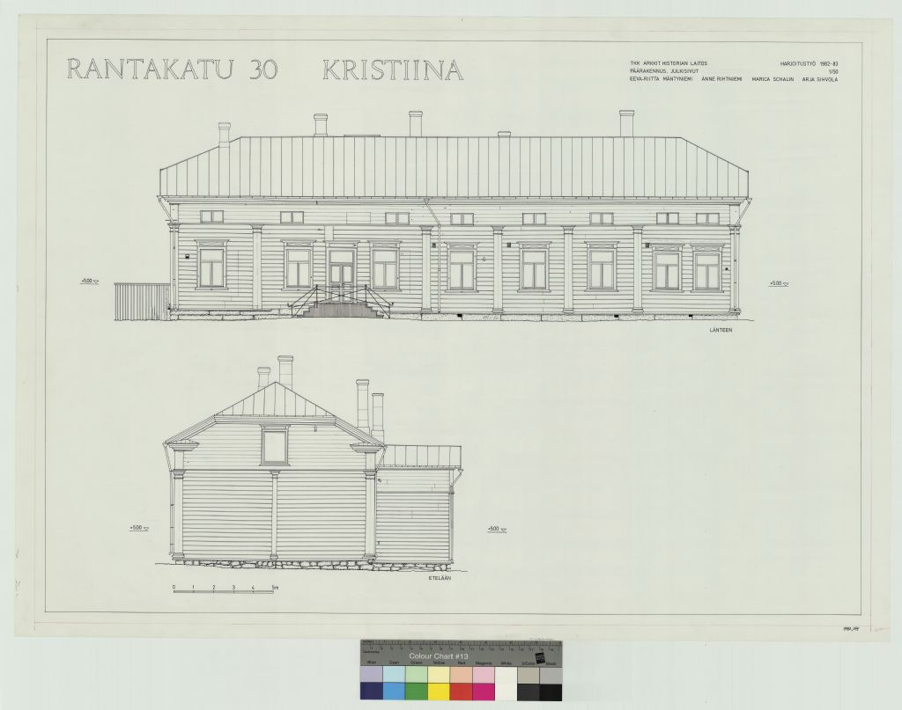

## Talon Historia

## Rakennusinventointi <a href="/sources/keinanen_karki.pdf">v.1967</a>
1. Pitkänurkkainen asuinrakennus vuodelta 1819, jatkettu pohjoiseen 1800-luvun puolivälissä, empirevuoraus, uurrettu vaakalaudoitus, pitkänurkkapilasterit, satulakatto. AII, MAII pvk. 1819

2. Pitkänurkkainen asuinrakennus 1800-luvulta, sekundaarinen vaakalaudoitus, satulakatto. C
3. Pitkänurkkainen asuinrakennus, vaakalaudoitus, satulakatto. B
4. itkänurkkainen asuinrakennus, ent.pakaritupa, peiterimelaudoitus, satulakatto. A
5. Pitkänurkkainen ulkorakennus, peiterimalaudoitus, satulakatto. A
6. Pitkänurkkainen ulkorakennus, satulakatto. B
7. Vaja, peiterimalaudoitus, satulakatto. C
8. Vaja + kellari, saumarimalaudoitus, satulakatto. C

## Nykytila

## Piirustukset
<table>
<tr>
<td><h2>Harjoitustyö 1982</h2></td><td>
</td>
</tr>
</table>
